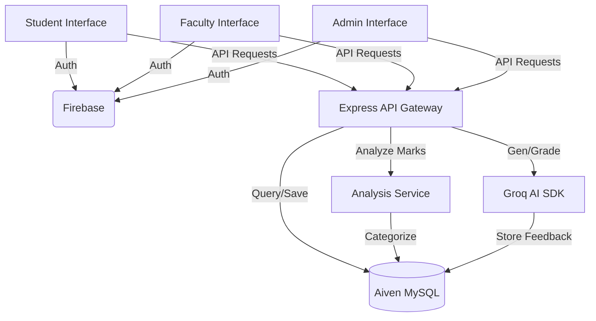

# PROJECT REPORT: Academic Knowledge Reinforcement System (AKRS)

## 1. Project Overview
The **Academic Knowledge Reinforcement System (AKRS)** is an intelligent educational platform designed to identify student learning gaps and provide automated, AI-driven reinforcement. It transitions away from traditional static grading to a dynamic, feedback-oriented learning cycle.

### Core Objectives
*   **Gap Identification:** Automatically categorize student performance into Weak, Needs Improvement, and Strong levels based on unit-wise marks.
*   **AI-Powered Practice:** Generate personalized practice tests using LLMs (Large Language Models) targeting specific weak units.
*   **Mentorship Integration:** Facilitate a structured relationship between faculty mentors and students for progress tracking and early access approvals.

---

## 2. Technical Stack

### **Frontend (Modern Web UI)**
*   **Framework:** React 18 (Vite-powered for performance).
*   **Routing:** React Router v6 (Role-based protected routes).
*   **State:** React Context API (Auth & User State).
*   **Analytics:** Recharts (Dynamic Bar, Line, and Radar charts).
*   **Aesthetics:** Premium Dark Theme, Glassmorphism, CSS Transitions.
*   **Icons:** Phosphor Icons / SVG library.

### **Backend (Robust API & Logic)**
*   **Runtime:** Node.js (Express Framework).
*   **AI Integration:** Groq SDK (Llama 3 70B/8B inference for question generation & grading).
*   **Database Admin:** mysql2 (Connection pooling, raw SQL optimization).
*   **Security:** Firebase Admin SDK (Server-side JWT verification).
*   **Utilities:** ExcelJS (Bulk data processing), Multer (File management).

### **Infrastructure & Services**
*   **Database:** Aiven MySQL (Cloud-hosted relational DB with SSL).
*   **Authentication:** Firebase Authentication (Google OAuth).
*   **Tunneling:** Ngrok (Secure local-to-web tunneling for development).

---

## 3. Database Schema (Relational Logic)

The system utilizes a structured MySQL schema (`akrs_db`):

| Category | Table | Primary Responsibility |
| :--- | :--- | :--- |
| **Core Identity** | `users` | Stores unique profiles (ID, Email, Role: admin/faculty/student). |
| **User Profiles** | `students` / `faculty` | Role-specific metadata (Student Code, Dept, Employee Code). |
| **Academic Org** | `courses` / `course_units` | Subjects and their 5-unit syllabus breakdown. |
| **Performance** | `marks` | Raw scores for internal, mid, and semester exams. |
| **Analysis** | `performance_analysis` | Derived performance levels (Weak <40%, Improving <75%, Strong ≥75%). |
| **AI Practice** | `practice_tests` | AI-generated questions, student answers, and AI evaluations. |
| **Relationships** | `enrollments` / `mentorship` | Mapping students to courses and mentors to mentees. |
| **Audit Logs** | `marksheet_uploads` | Tracking status of bulk mark imports. |

---

## 4. User Pages & Features

### **Student Portal**
*   **Dashboard:** Overview of subject levels and "Focus Areas" recommendations.
*   **Performance:** Detailed unit-by-unit grade analysis.
*   **AI Practice:** Interface to schedule tests and review AI-graded feedback.
*   **Learn Tracker:** Log study hours and monitor preparation progress.
*   **Materials:** Access to course-specific documents and links.

### **Faculty (Mentor) Portal**
*   **Dashboard:** Monitoring assigned mentees and course performance.
*   **Students List:** Searchable database of students in assigned courses.
*   **Mentee Details:** Deep dive into specific student logs and AI test scores.
*   **Test Requests:** Approve student reasons for "Early Access" to practice tests.
*   **Marks Upload:** Manual entry or bulk Excel upload for course units.

### **Admin Portal**
*   **AIPractice Logs:** System-wide monitoring of AI usage and results.
*   **User/Course Management:** CRUD operations for system entities.
*   **Global Analytics:** Departmental and semester-wide performance trends.
*   **Library:** Centrally manage learning materials for all courses.

---

## 5. Working Flows & Systems

### **A. Authentication Workflow**
1.  User signs in via Google (Frontend).
2.  Firebase ID Token is sent to Backend.
3.  Backend verifies token and matches email against the `users` table.
4.  If email exists, role is returned; otherwise, access is denied.

### **B. Performance Analysis Engine**
*   Upon mark entry, the system calculates percentage: `(marks / max_marks) * 100`.
*   Assigns `performance_level` based on strict academic thresholds.
*   Recommendations are generated as: *"Focus urgently on [Course] Unit [Number]"*.

### **C. AI Practice Test Cycle**
1.  **Scheduling:** Student schedules a test for a "Weak" unit.
2.  **Lock Period:** Mandatory 24-hour study lock (can be bypassed via Mentor approval).
3.  **Generation:** Groq AI generates 10 scenario-based questions for that specific unit title.
4.  **Taking Test:** Student submits descriptive answers under full-screen monitoring.
5.  **Grading:** AI evaluates answers for technical accuracy and awards marks (0-10 per question).
6.  **Promotion:** If the student scores ≥70%, the unit is automatically upgraded to "Needs Improvement".

### **D. Malpractice Safeguard**
*   The system detects when a student exits full-screen or switches tabs during an AI practice test.
*   If detected, the test is immediately invalidated, and a score of 0 is recorded with a "Malpractice" flag.

---

## 6. Project Architecture Diagram

---
